# butterfly-codex

## Description
The Butterfly Codex is web app for researching and tracking butterflies of the United States, where an authenticated user can add sightings that in turn populate maps that appear on individual butterfly information pages. It was built using React, Bootstrap, SCSS, and Leaflet.

## Screenshots
### Desktop
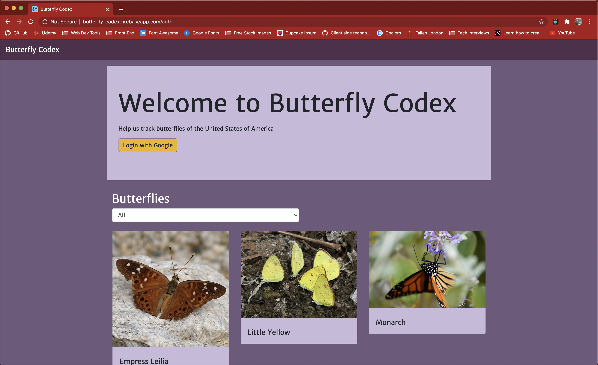

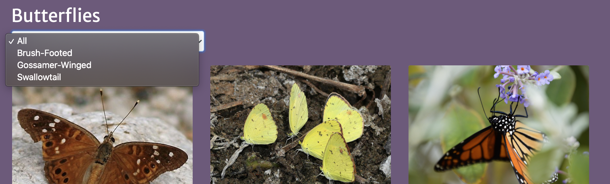

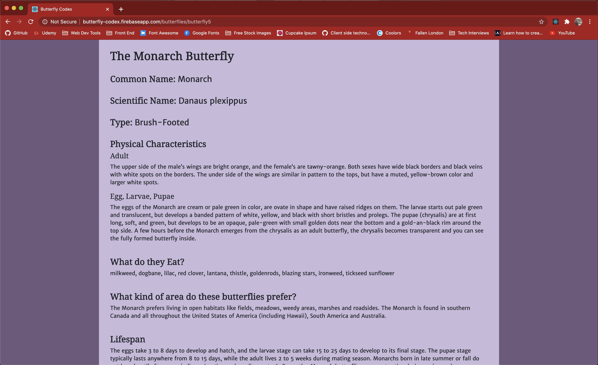
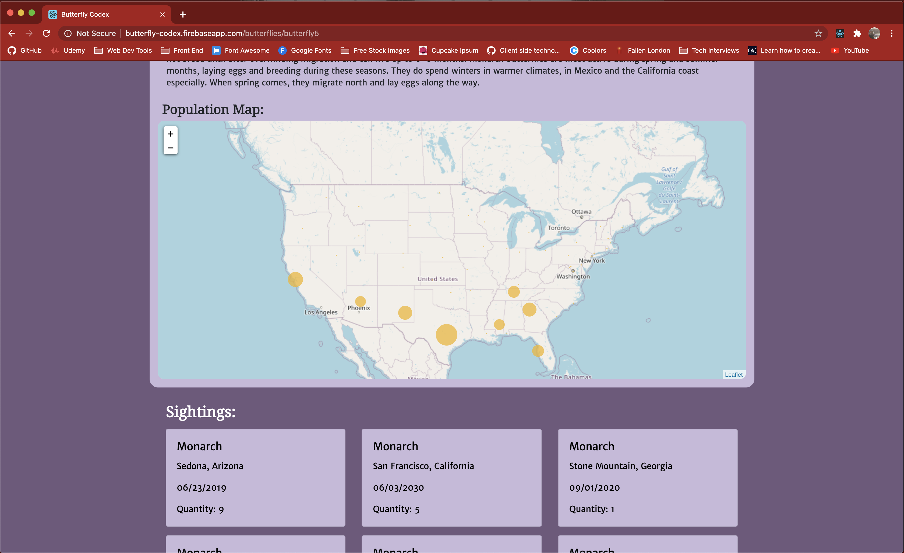
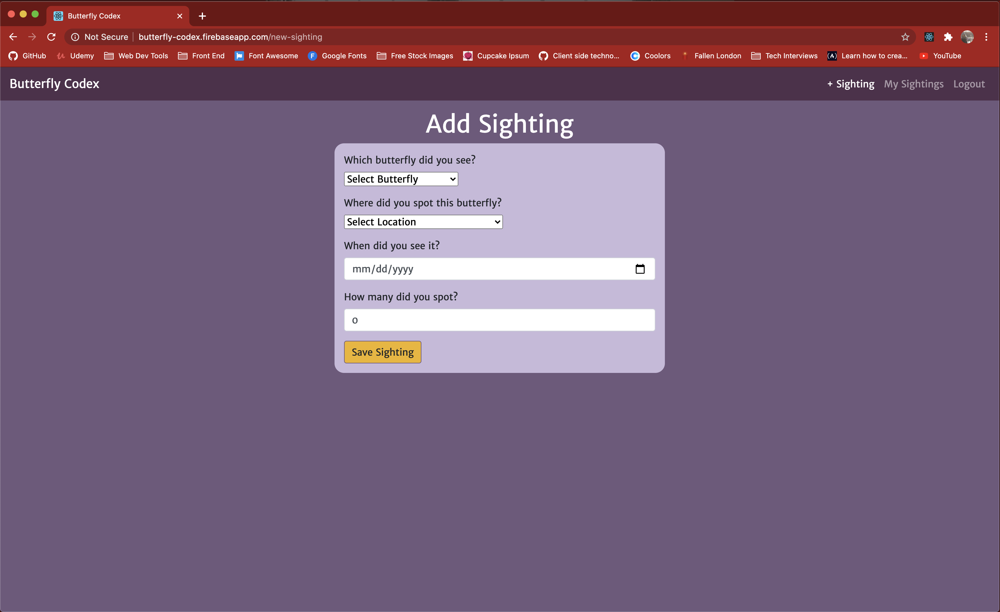
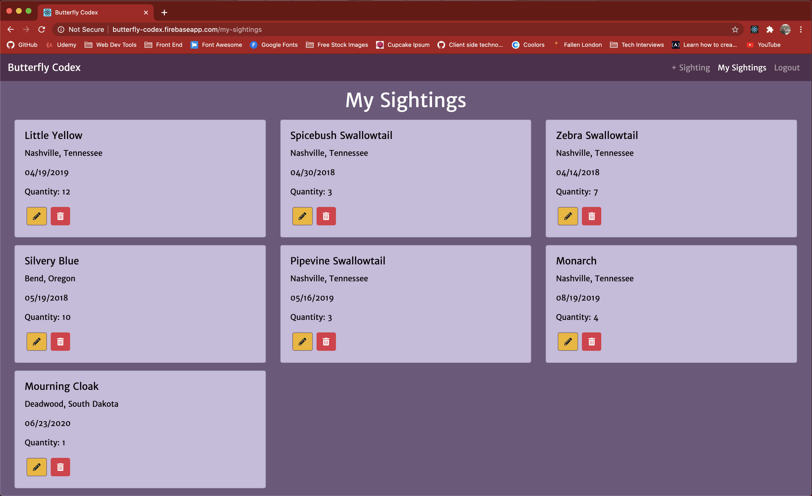
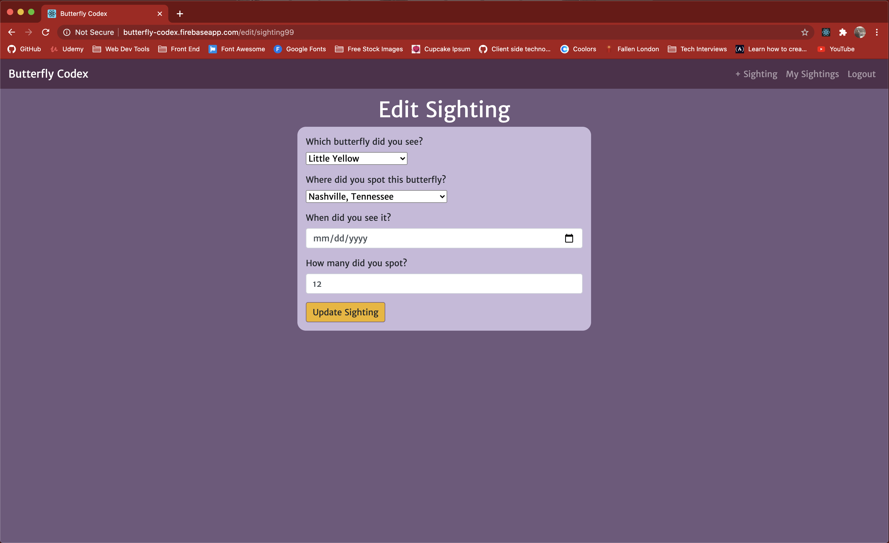

### Mobile
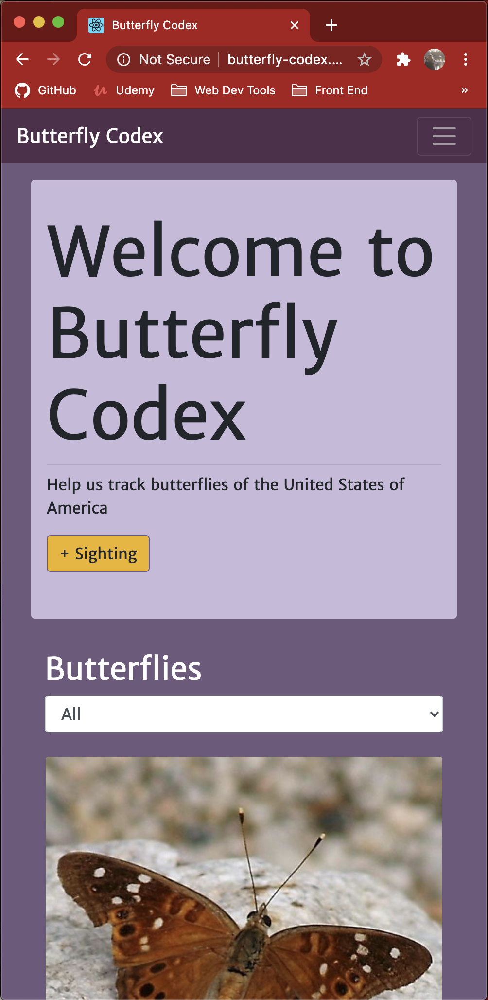
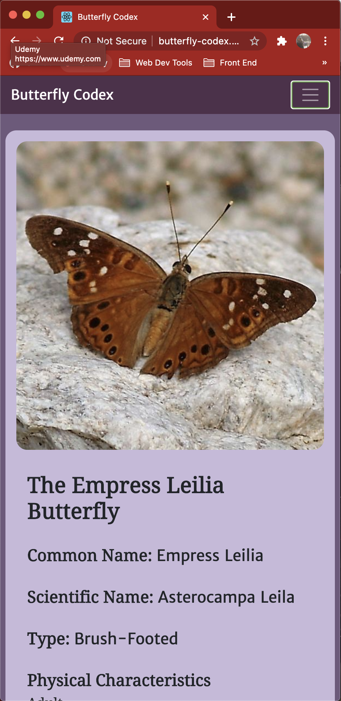
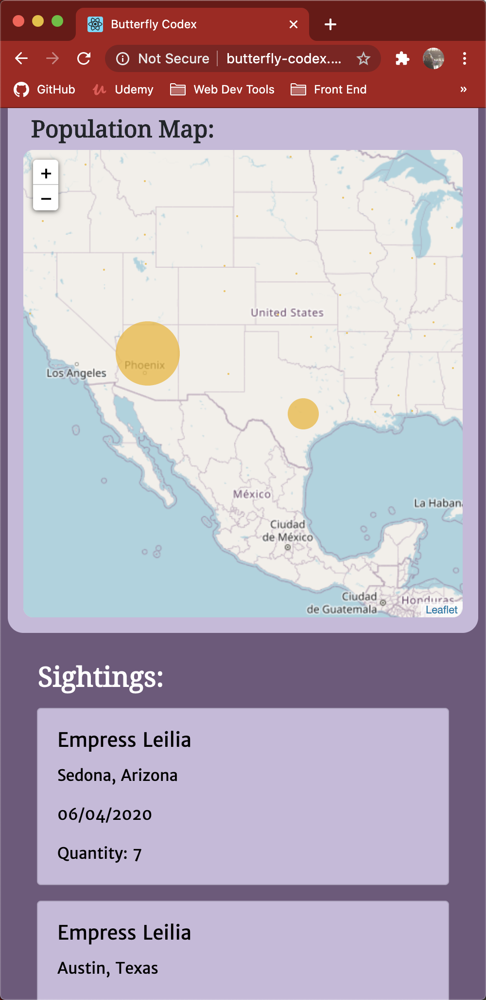
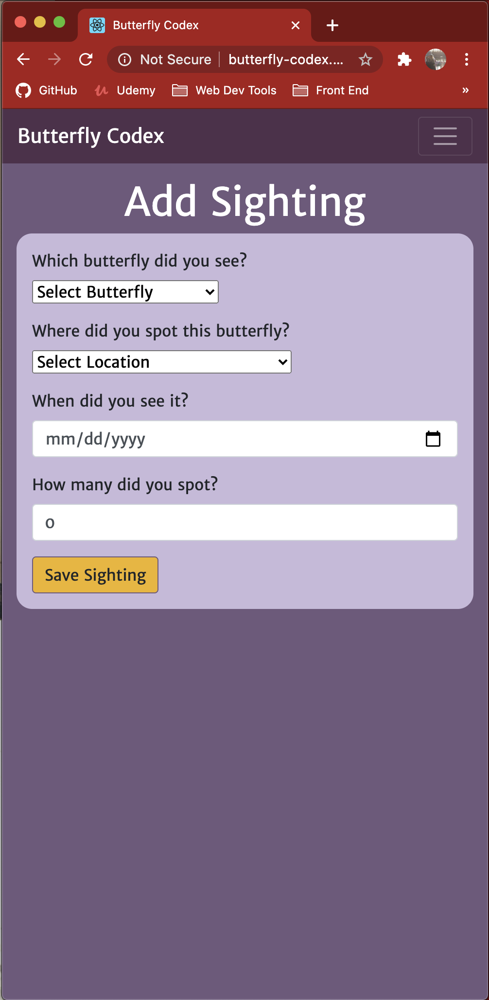
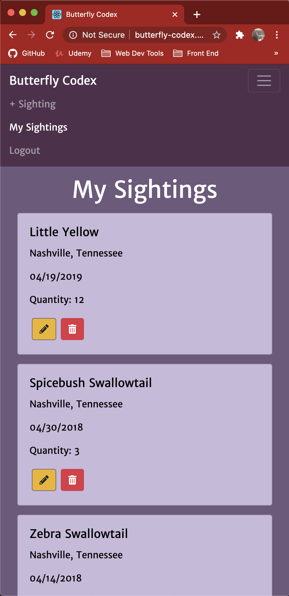
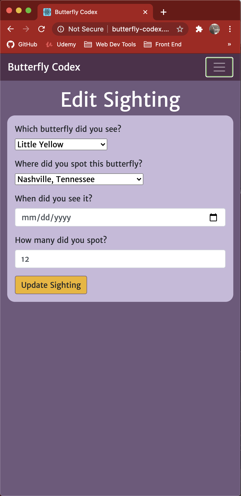

## Instructions
[Visit the live application here](https://butterfly-codex.web.app/auth)
1. Clone down this repo
2. Create a firebase project [here](https://firebase.google.com/)
3. Update the `apiKeys.example.json` with the information from the project you created and remove the word example from the file name
4. run `npm start` in your terminal